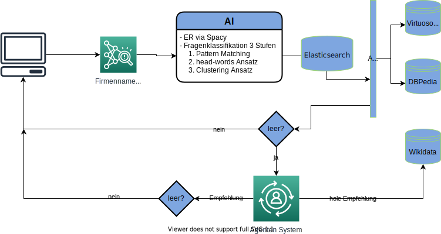
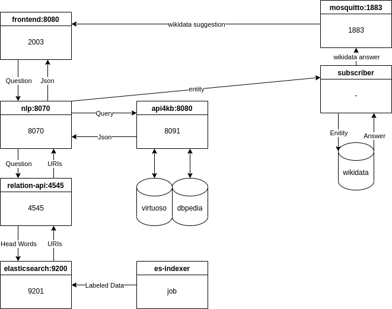

# cisqa20

Corporate Smart Insights Question Answering.
A wiki can be found at https://gitlab.fokus.fraunhofer.de/quratorap1/cisqa20/-/wikis/Repo-Overview

### Workflow Diagram:



# 0 Notice

Logging file gets deleted after file opening in the newest docker version (2.4.0.0).
Use Docker 2.3.0.5

# 1 Demo
Aktueller Stand des FOKUS-branch via CD: (http://eco-qa.demo.quartor.apps.osc.fokus.fraunhofer.de/) in FOKUS network (or VPN)


#### 1.1 Dgap Info Request (api4kb)

1. [Alle Nachrichten zu Nemetschek](http://eco-qa.demo.quartor.apps.osc.fokus.fraunhofer.de/result/start/Alle%20Nachrichten%20zu%20Nemetschek)
1. [aktuelle Nachrichten zu Nemetschek](http://eco-qa.demo.quartor.apps.osc.fokus.fraunhofer.de/result/start/aktuelle%20Nachrichten%20gibt%20es%20zu%20Nemetschek)
1. [Wie viele Nachrichten zu Nemetschek?](http://eco-qa.demo.quartor.apps.osc.fokus.fraunhofer.de/result/start/Wie%20viele%20Nachrichten%20zu%20Nemetschek%3F)
1. [Wie viele aktuelle Nachrichten gibt es zu Nemetschek](http://eco-qa.demo.quartor.apps.osc.fokus.fraunhofer.de/result/start/Wie%20viele%20aktuelle%20Nachrichten%20gibt%20es%20zu%20Nemetschek)
1. [Wo befindet sich Nemetschek?](http://eco-qa.demo.quartor.apps.osc.fokus.fraunhofer.de/result/start/Wo%20befindet%20sich%20Nemetschek)
1. [Umsatz Prognose für 2020](http://eco-qa.demo.quartor.apps.osc.fokus.fraunhofer.de/result/start/Umsatz%20Prognose%20f%C3%BCr%202020)
1. [Umsatz von Pseudo gmbh](http://eco-qa.demo.quartor.apps.osc.fokus.fraunhofer.de/result/start/Umsatz%20von%20Pseudo%20gmbh)

#### 1.2 Wikipedia Data Request (api4kb)

1. [Adidas](http://eco-qa.demo.quartor.apps.osc.fokus.fraunhofer.de/api/query?query=Adidas)
1. [addidas](http://eco-qa.demo.quartor.apps.osc.fokus.fraunhofer.de/result/start/addidas)
1. [Aktiva von Adidas](http://eco-qa.demo.quartor.apps.osc.fokus.fraunhofer.de/result/start/Aktiva%20von%20Adidas)
1. [Produkte von Adidas](http://eco-qa.demo.quartor.apps.osc.fokus.fraunhofer.de/result/start/Produkte%20von%20Adidas)
1. [Gründungsjahr von Adidas](http://eco-qa.demo.quartor.apps.osc.fokus.fraunhofer.de/result/start/Gr%C3%BCndungsjahr%20von%20Adidas)


# 2 Get started

<details>
  <summary markdown="span">if working Remote from qurator server with vs-code IDE (click me)</summary>

1. Install [vs-code](https://code.visualstudio.com/)
1. Click on Extension symbol on the left side
1. Search "Remote-SSH" and install version v0.49.0
1. Click on the green bottom left corner "Open a Remote Window"
1. Choose "Connect to Host" in drop down menu, which pops up.
1. Enter your-user-name@qurator-server-ip
1. Enter your password
</details>


#### 2.1 Pulling
```
git clone https://gitlab.fokus.fraunhofer.de/quratorap1/cisqa20.git
git submodule update --init --recursive
```

#### 2.2 Building
##### to use: 
 :warning: **VPN needed - cisco annyconnect client will not work**:

```
sudo apt install openconnect
sudo apt install network-manager-openconnect
```

NetworkManager -> Edit connections -> Add. Then select Connection type to be VPN -> Cisco Annyconnect

Gateway: pixgate.fokus.fraunhofer.de

```
docker login https://dockerhub.fokus.fraunhofer.de:5000/
docker-compose up --build
```
# 3 Currently used Ports:

frontend
- Port from outside http://localhost:2003/
- Port for docker inside communication [frontend:8080](frontend:8080)



# 4 Documentation
Code Documentation\
doc > vXXXXXXXX > index.html

Graph\
doc > Graph.pdf

Component Map\
doc > Modul.pdf

# 5 Version History

##### V3
- semantic-api and nlp merge 

###### V2Embed
- New: relation-api
- Uses word embeddings to find relation URI (label will be compared with head word using elasticsearch)
- Builds SPARQL query with returned URIs

###### FOKUS
- SPARQL template with #HEAD-WORD comment
- if head-word then #HEAD-WORD comment will be removed
- Example: "#CEOS ?keyPerson" turns to "?keyPerson"
###### FOKUS v.05-08-2020
- Map Fixed

###### FOKUS v.13-07-2020
- Stock Business Data Q&A
- Triple Store Backend
- http://localhost:5001/api/query?query=aktuelle%20Nachrichten%20zu%20Adidas


# 7 Adhoc news Evaluation
See https://gitlab.fokus.fraunhofer.de/quratorap1/adhoc-qa/-/blob/master/adhoc.csv for questions and statuses
